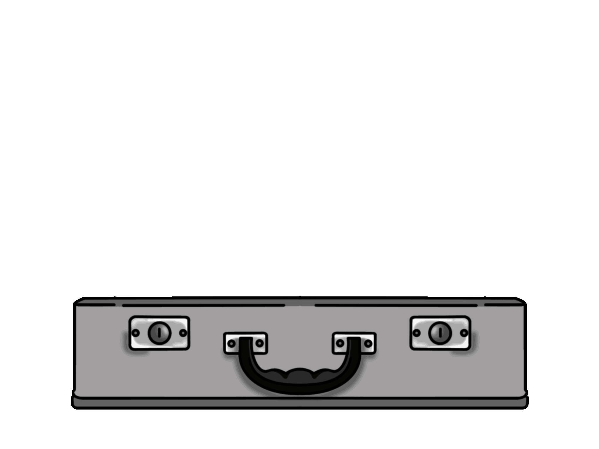

Smart Tour
====
## A Flutter Project

<p float="middle">
  
</p>


# Index

* [Index](#index)
* [Project Status](#project-status)
* [Project Description](#project-description)
* [Access the Project](#-access-the-project)
* [Requirements](#-requirements)
* [Project Features](#-project-features)
* [Run the Project](#-run-the-project)
* [Authors](#-authors)

# Project Status


# Project Description

<div style="text-align: right"> This application is being developed on account of a college project. The application will help people on their trips to find the best tourist spots according to each one's profile. This profile will initially be created from a form with predetermined answers, and in the future we intend to implement each person's profile using only their instagram profile, so that the user does not have to fill out or update their form. Finally, a ranking system will be made using the evaluations of the tourist points of each user. </div>


# 📁 Access the Project

**Is found in Github: "https://github.com/rogeralencar/PI3A-Smart-Tour"**

# 📝 Requirements

- ## Install the DartSDK in your machine

**https://dart.dev/get-dart**

- ## Install the FlutterSDK in your machine

**https://docs.flutter.dev/get-started/install**
 
- ## Install and configure AndroidStudio in your machine

**https://developer.android.com/studio**

# 🔨 Project Features

- `Feature 1`: icon image
- `Feature 2`: split screen
- `Feature 3`: compatible for both devices IOS and Android
- `Feature 4`: onboarding screen
- `Feature 5`: form using drag and drog system

# ▶ Run the Project

- `To execute the programm, use:`

```console
flutter run "lib/src/main.dart"
```

# 🗎 Article 

 - [Overleaf Article](https://www.overleaf.com/project/6428a4b9af8eba9be78890d2)

# 👨‍💻 Authors

| [<br><sub>Guilherme Queiroz Ribeiro</sub>](https://github.com/Gui1111RIbeiro) | [<br><sub>Roger Alencar</sub>](https://github.com/rogeralencar) | [<br><sub>Amanda Anchieta</sub>](https://github.com/amandaxva) | [<br><sub>Eduardo Alvim</sub>](https://github.com/dudualvim)
| :---: | :---: | :---: | :---: |

### End

For help getting started with Flutter development, view the
[online documentation](https://docs.flutter.dev/), which offers tutorials,
samples, guidance on mobile development, and a full API reference
